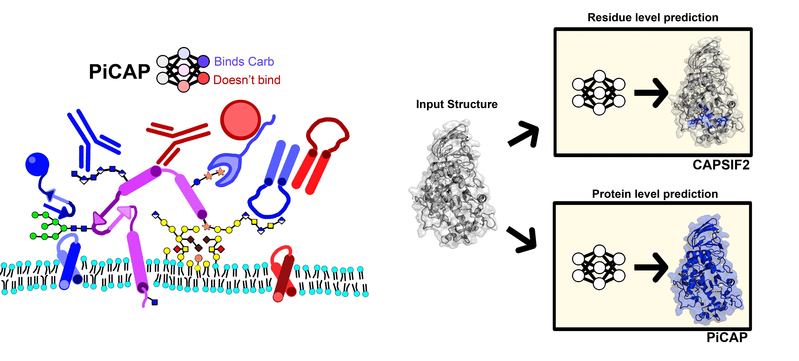

# CAPSIF2 and PiCAP #



## Quick Setup Guide ##
```
mkdir pre_pdb
mkdir output_data
mkdir models_DL
conda env create -f picap.yml
conda activate picap
```

### To get the model weights ###
```
cd models_DL
wget https://data.graylab.jhu.edu/picap_capsif2/model-picap.pt
wget https://data.graylab.jhu.edu/picap_capsif2/model-capsif2.pt
cd ..
```


Or you can manually download with the following:

The weights of each model are stored on our remote server [`data.graylab.jhu.edu/picap_capsif2/`](https://data.graylab.jhu.edu/picap_capsif2/)

Download `model-picap.pt` and `model-capsif2.pt` to `capsif2_clean/models_DL/`

# How to run: Command Line #
Put all PDB (or CIF) files into the `input_pdb/` directory
```
python run_both.py
```
#### If using only PiCAP: ####
```
python run_both.py --picap_only
```
#### If using only CAPSIF2: ####
```
python run_both.py --capsif2_only
```

#### If using computational structures with a pLDDT cutoff ####
```
python run_both.py --high_plddt --plddt_cutoff 70
```
`plddt_cutoff` can be changed to any value, the publication uses 70 as the cutoff for AF2 structures.

the predictions will then be outputted to `output_data/predictions_prot.tsv` and `output_data/predictions_res.tsv` for PiCAP and CAPSIF2, respectively.

If running both, then the data will be outputted to `output_data/all_predictions.tsv`

All predictions for CAPSIF2 are also outputted individually as PDB files in the `output_data/` directory.


# How to run: Notebook #
Put all PDB (or CIF) files into the `input_pdb/` directory

### Single structure prediction ###
Load the `sample_notebook.ipynb` to run a single structure through (no `high_plddt` option provided), which allows quick analysis and viewing of a single structure.

### Multi structure prediction ###
Load the `notebook_predict_directory.ipynb` and run the script to predict for all structures in the `input_pdb/` directory.


## Supplemental data ##

We include the NoCAP and DR datasets in the `datasets/` directory with a list of PDBs. All non-RCSB retrievable structures (e.g. designed non-binders and ProGen lysozymes) are at the remote server [`data.graylab.jhu.edu/picap_capsif2/`](https://data.graylab.jhu.edu/picap_capsif2/).

Use case note, due to pyrosetta problems, we only can use PDB files for input so all cif files are converted using Bio.PDB to pdb files and then output as a pdb to the `output_data/` directory.


### Training Code ###
A simplified version of the training code is provided in `./training_code/` for quick modification and alteration if desired.
