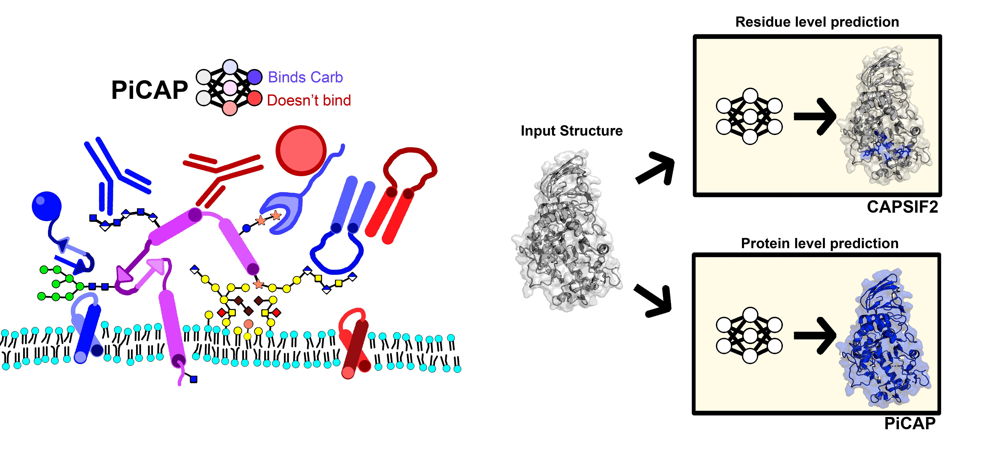

# CAPSIF2 and PiCAP #



Official repository for Protein interaction of CArbohydrate Predictor (PiCAP) and CArbohydrate-Protein Site IdentiFier2 (CAPSIF2) from the paper: 
[`Predictions from Deep Learning Propose Substantial Protein-Carbohydrate Interplay`](https://doi.org/10.1101/2025.03.07.641884)

<details><summary><b>Citation</b></summary>
Predictions from Deep Learning Propose Substantial Protein-Carbohydrate Interplay

Samuel W Canner, Ronald L Schnaar, Jeffrey J Gray

bioRxiv 2025.03.07.641884; doi: https://doi.org/10.1101/2025.03.07.641884
</details>

Protein interaction of CArbohydrate Predictor (PiCAP) is deep learning model to predict whether a protein binds to a carbohydrate using a protein’s sequence and structure in tandem. PiCAP uses ESM2 embeddings and the input structure to identify if the protein has the capacity to bind to carbohydrates.

Carbohydrate Protein Site IdentiFier 2 (CAPSIF2) is a deep learning model to predict protein-carobhydrate binding sites. CAPSIF2 predicts on a residue level which residues are implicated in protein binding. It uses a 3D equivariant graph neural network for predictions.

## Proteome Data

All data for the proteome analysis is available at : [`datasets/proteome_results.xlsx`]([https://data.graylab.jhu.edu/picap_capsif2/](https://github.com/Graylab/picap/tree/main/datasets)).

## PiCAP + CAPSIF2 Installation

### RosettaCommons PiCAP container

##### Licensing
The PiCAP protocol requires set of tools to run. To streamline this process, we provide a Docker container that includes all necessary applications pre-installed, offering a straightforward command-line interface for running the PiCAP protocol.

Please note that the provided Docker image includes **PyRosetta** which **require a commercial license for non-academic use**. For more details, please refer to: [RosettaCommons](https://github.com/RosettaCommons/rosetta)

### Running PiCAP Using the RosettaCommons Docker Container

To run the application, use the `picap` or `capsif-2` scripts with same same command line options as `run_both.py` (see local install section below).

#### Example Usage:
```sh
mkdir ./input_pdb
mkdir ./output_data
# copy your input files into input_pdb dir
docker run -it -v ./input_pdb:/picap/input_pdb -v ./output_data:/picap/output_data rosettacommons/picap --high_plddt --plddt_cutoff 70
```

For a full list of available options, run: `docker run -it rosettacommons/picap picap --help`

### Local Install
```
mkdir pre_pdb
mkdir output_data
mkdir models_DL
conda env create -f picap.yml
conda activate picap
```

### To get the model weights ###
```
cd models_DL
wget https://data.graylab.jhu.edu/picap_capsif2/model-picap.pt
wget https://data.graylab.jhu.edu/picap_capsif2/model-capsif2.pt
cd ..
```


Or you can manually download with the following:

The weights of each model are stored on our remote server [`data.graylab.jhu.edu/picap_capsif2/`](https://data.graylab.jhu.edu/picap_capsif2/)

Download `model-picap.pt` and `model-capsif2.pt` to `capsif2_clean/models_DL/`

# How to run: Command Line #
Put all PDB (or CIF) files into the `input_pdb/` directory
```
python run_both.py
```
#### If using only PiCAP: ####
```
python run_both.py --picap_only
```
#### If using only CAPSIF2: ####
```
python run_both.py --capsif2_only
```

#### If using computational structures with a pLDDT cutoff ####
```
python run_both.py --high_plddt --plddt_cutoff 70
```
`plddt_cutoff` can be changed to any value, the publication uses 70 as the cutoff for AF2 structures.

the predictions will then be outputted to `output_data/predictions_prot.tsv` and `output_data/predictions_res.tsv` for PiCAP and CAPSIF2, respectively.

If running both, then the data will be outputted to `output_data/all_predictions.tsv`

All predictions for CAPSIF2 are also outputted individually as PDB files in the `output_data/` directory.


# How to run: Notebook #
Put all PDB (or CIF) files into the `input_pdb/` directory

### Single structure prediction ###
Load the `sample_notebook.ipynb` to run a single structure through (no `high_plddt` option provided), which allows quick analysis and viewing of a single structure.

### Multi structure prediction ###
Load the `notebook_predict_directory.ipynb` and run the script to predict for all structures in the `input_pdb/` directory.


## Supplemental data ##

We include the NoCAP and DR datasets in the `datasets/` directory with a list of PDBs. All non-RCSB retrievable structures (e.g. designed non-binders and ProGen lysozymes) are at the remote server [`data.graylab.jhu.edu/picap_capsif2/`](https://data.graylab.jhu.edu/picap_capsif2/).

Use case note, due to pyrosetta problems, we only can use PDB files for input so all cif files are converted using Bio.PDB to pdb files and then output as a pdb to the `output_data/` directory.


### Training Code ###
A simplified version of the training code is provided in `./training_code/` for quick modification and alteration if desired.
